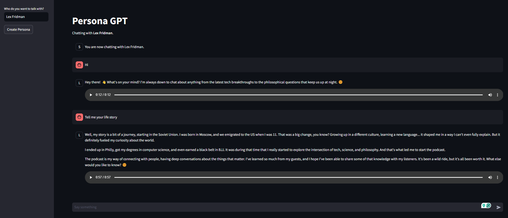

# PersonaGPT
Chat with any famous personality you want to on whatever topic.

Current Workflow - 
1. Scrape Wiki for given persona
2. Scrape news and articles and find information and statements
3. Search YouTube for relevant videos, download and extract audio
4. Chat with web search enabled
5. Synthesize speech for responses


## Setup 

```python3 -m venv myenv```

```source myenv/bin/activate```


### Install dependencies


```pip install -r requirements.txt```

### Set Gemini API Key
```export GEMINI_API_KEY=your_api_key```

## Run
```streamlit run app.py```

### How to use?
1. Enter the name of any famous personality. eg Elon Musk

2. Use the chat interface to chat with them.


## Example Conversation
